# Отчет по лабораторной работе №4

Выполнили: **Ячменников**, **Александров**

## Краткая документация по реализованным методам

### adam.py

Реализован метод оптимизации `Adam` (Adaptive moment estimation).

Adam включает в себя два других метода - `Momentum/Nesterov` + `AdaGrad/RMSProp`. У нас реализована версия `Momentum + RMSProp`.

`Momentum` или `Метод тяжелого шарика` является модификацией GD и работает по принципу инерции. Шаг реализуется по формуле:

$$x_{t+1} = x_t - \alpha \cdot v_t,$$

где $v_t$ - инерция:

$$v_t = \beta \cdot v_{t-1} + (1 - \beta) \cdot \nabla f,$$

где $\beta$ - коэффициент инерции (обычно $\approx 0.9$).

Таким образом метод накапливает "ускорение" и сходится быстрее GD.

`RMSProp` (Residual Mean Square Propagation) - модификация `AdaGrad`.

AdaGrad регулирует learning_rate суммой квадратов всех предыдущих градиентов:

$$G_t = \nabla f(x_1)^2 + \ldots + \nabla f(x_t)^2$$

$$x_{t+1} = x_t - \frac{\alpha}{\sqrt{G_t} + \epsilon} \cdot \nabla f(x_t)$$

т.о. если градиент большой - уменьшаем шаг сильнее, иначе - слабее. Однако проблема заключается в том, что сумма квадратов градиентов копится и шаг становится маленьким даже для маленьких градиентов.

RMSProp решает эту проблему, ослабляя влияние старых градиентов, сильнее учитывая недавние. Вместо суммы квадратов градиентов метод использует скользящее экспоненциальное среднее:

$$S_t = \beta S_{t-1} + (1 - \beta) \nabla f(x_t)^2, \beta \approx 0.9$$

$$x_t = x_t - \frac{\alpha}{\sqrt{S_t} + \epsilon} \cdot \nabla f(x_t)^2$$

Т.о.:

$$S_t = (1 - \beta) \cdot (\nabla f(x_t)^2 + \beta \cdot \nabla f(x_{t-1})^2 + \beta^2 \cdot \nabla f(x_{t-2})^2 + \ldots)$$

т.к. $\beta \in (0, 1)$ влияние старых градиентов затухает.

Наконец Adam. Метод учитывает:
1) Историю градиентов и сглаживает направление движения (Momentum)
2) Историю квадратов градиентов и адаптирует размер шага (RMSProp)

Формула:

$$x_{t+1} = x_t - \alpha \cdot \frac{\hat{m}_t}{\sqrt{\hat{v}_t} + \epsilon}$$

Здесь $\hat{m}_t$ и $\hat{v}_t$ - $G_t$ и $S_t$ с коррекцией смещения (нужна для того, чтобы компенсировать заниженность оценок первого и второго моментов в самом начале обучения):

$$\hat{m}_t = \frac{m_t}{1 - \beta^t}$$

### sln.py

Реализована односвязная нейрнонная сеть для бинарной классификации по схеме:

$$X \rightarrow XW + b \rightarrow \text{BReLU} \rightarrow \text{Sigmoid} \rightarrow \hat{y}$$

Веса корректируются обратным распространением ошибки с помощью Adam с регулируемым размером батча (вычисляются градиента для каждого перехода и вычитаются из весов согласно формуле Adam).

### perceptron.py

Реализован перцептрон с одним скрытым слоем по схеме:

$$X \rightarrow XW_1 + b_1 \rightarrow \text{BReLU} \rightarrow A_1 W_2 + b_2 \rightarrow \text{Sigmoid} \rightarrow \hat{y}$$

## Анализ результатов
### Данные
Нужно протестировать реализованные бинарные классификаторы на следующих данных:

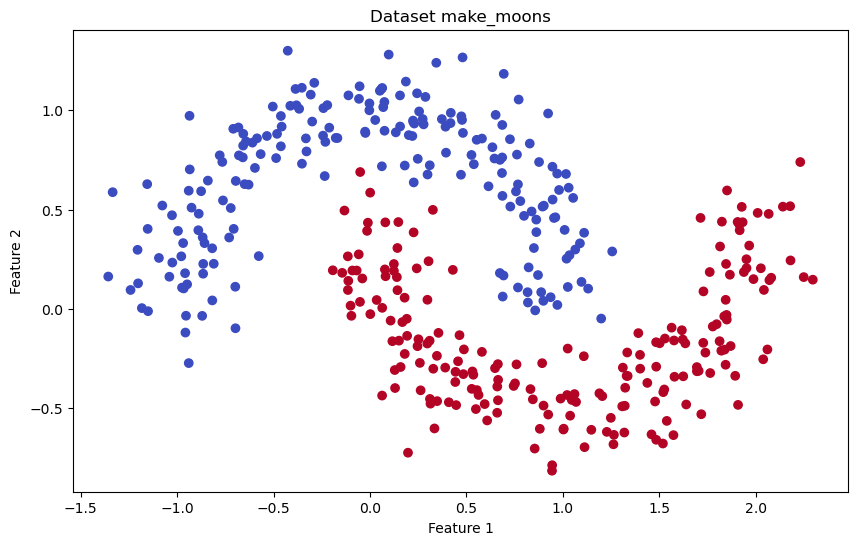
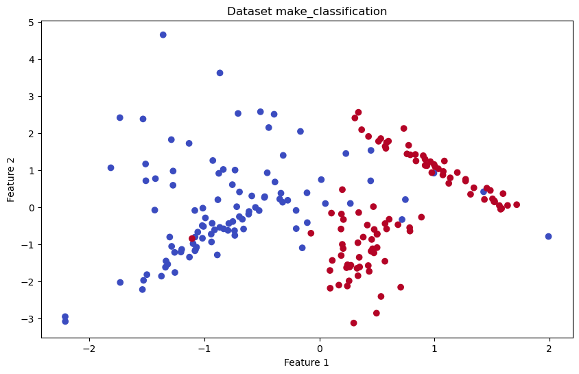

### SLN
#### make_moons
##### Валидация

Подберем гиперпараметры модели. Для этого обучим на train и оценим метрики по предсказаниям на validation:

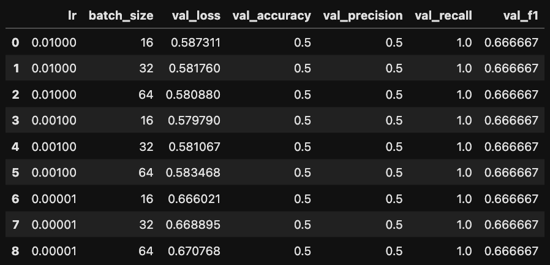

Метрики классификации получились одинаковые, поэтому ориентируемся на loss. Выбираем 3-ий набор гиперпараметров с минимальным loss.

##### Обучение
Подобрав оптимальные гиперпараметры ($\text{lr} = 0.001$, $`\text{batch\_size} = 16`$), обучаем модель.

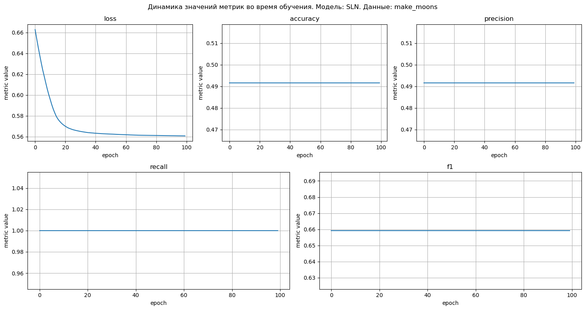

##### Тест
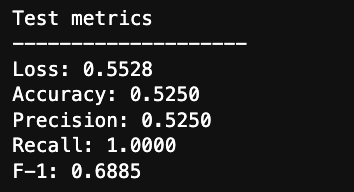

##### Вывод
loss падает при обучении однако сходится к $\approx 0.5$, остальные метрики тоже около $0.5$. \
Дело в том, что модель практически линейная, функции активации BReLU и Sigmoid не спасают ситуацию, так как просто применяются поверх линейной комбинации, а после них комбинации признаков не считаются, поэтому они по факту просто переводят в интервал $(0, 1)$. Поэтому модель не может построить сложную нелинейную границу.

#### make_classification
##### Валидация

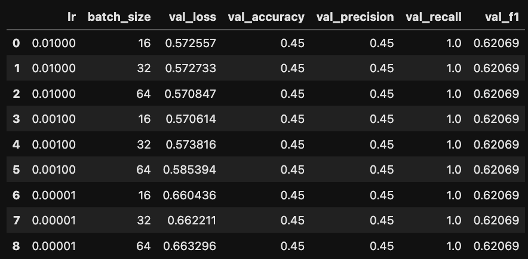

Метрики классификации получились одинаковые, поэтому ориентируемся на loss. Выбираем 3-ий набор гиперпараметров с минимальным loss.

##### Обучение
Подобрав оптимальные гиперпараметры ($\text{lr} = 0.001$, $`\text{batch\_size} = 16`$), обучаем модель.

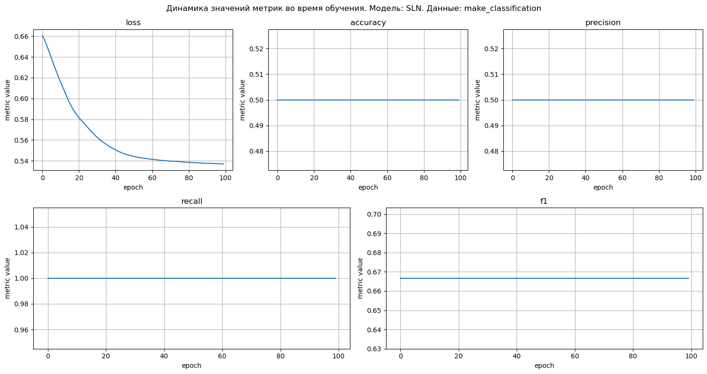

##### Тест
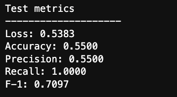

##### Вывод
Все то же самое - под капотом по сути линейная модель не может построить сложную разделяющую границу.

### Perceptron
#### make_moons
##### Валидация

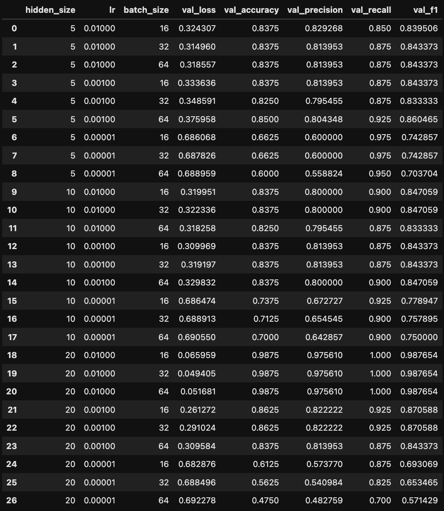
Здесь уже интереснее, гиперпараметры хотя бы влияют на модель! Ориентироваться будем в первую очередь на f-1 score. Наилучший f-1 у 19-21 строк. Остальные метрики у них тоже высокие относительно соатльных строк. Берем набор из 19 строки так как он чуть-чуть выигрывает по loss.

##### Обучение
Подобрав оптимальные гиперпараметры ($`\text{hidden\_size} = 20`$, $\text{lr} = 0.01$, $`\text{batch\_size} = 32`$), обучаем модель.

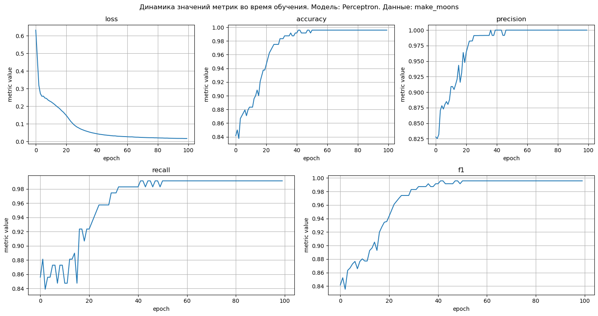

Результаты впечатляют, но такие высокие показатели могут свидетельствовать о переобучении, поэтому посмотрим на тестовую выборку.

##### Тест

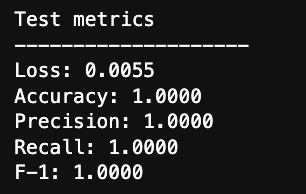

Модель идеально справляется на тестовой выборке, все метрики классификации равны 1, loss $\approx 0.005$. Это свидетельствует о том, что модель идеально построила границу между классами и судя по loss'у предсказывает очень хорошие вероятности, макисмально близкие к меткам своих классов (размер теста - 80 объектов).

#### make_classification
##### Валидация

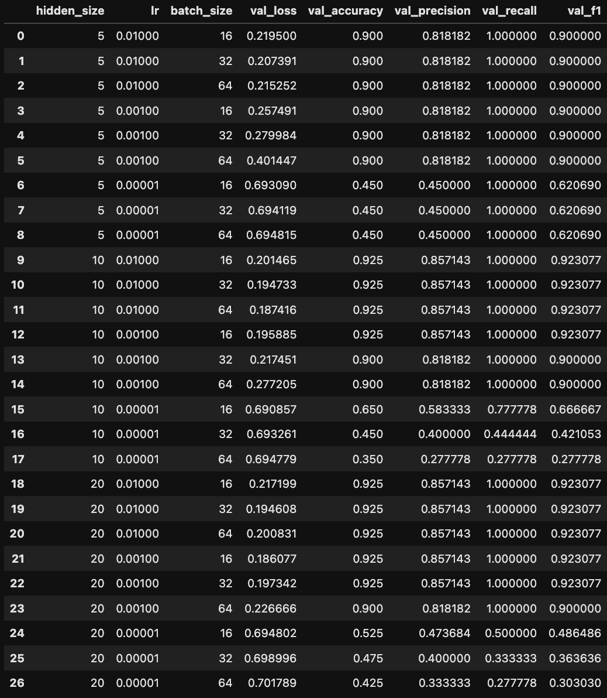
По тем же соображениям, что и на прошлой валидации, выбираем 19 строку.

##### Обучение
Подобрав оптимальные гиперпараметры ($`\text{hidden\_size`} = 20$, $\text{lr} = 0.01$, $\text{`batch\_size`} = 32$), обучаем модель.

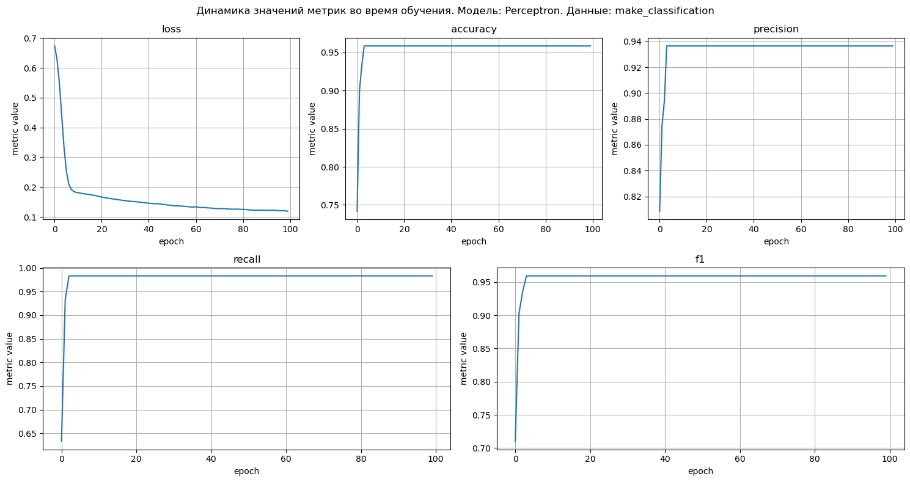

##### Тест

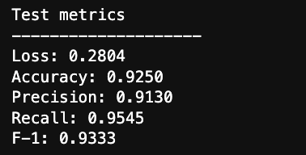

Здесь уже модель справилась чуть похуже, но и по визуализации датасетов можно сказать, что здесь идеальную границу построить сложнее. Тем не менее результаты хорошие.

## Выводы
Для задачи классификации со сложной нелинейной границей между классами модели рассматривающие только линейную комбинацию показывают себя ожидаемо посредственно. Для таких задач следует рассматривать более сложные модели, способные строить нелинейные комбинации.